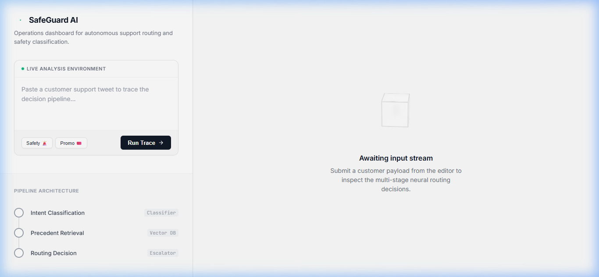
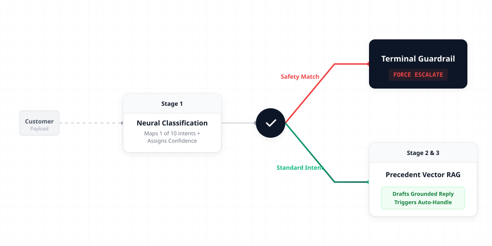
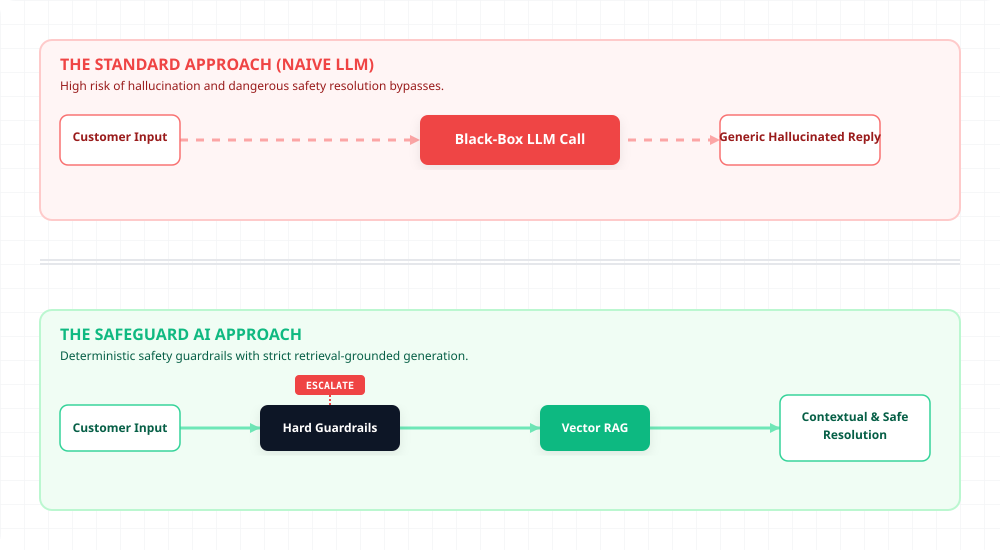
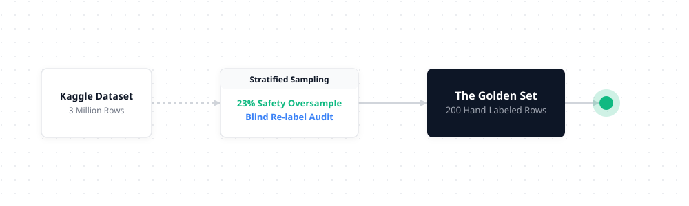
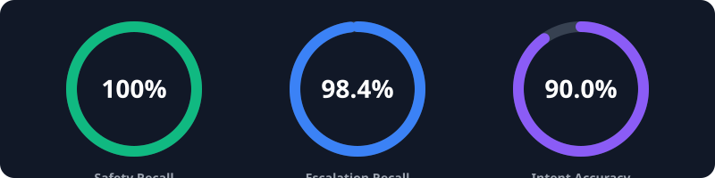

*This project provides a robust, math-backed neural pipeline to autonomously route, classify, and intelligently resolve customer support telemetry.*

<p align="center">
  Intelligent AI Support Routing with Hard-Coded Safety Boundaries
</p>

<p align="center">
  <a href="#quick-start"><b>Quick Start</b></a> •
  <a href="#architecture-flow"><b>Architecture</b></a> •
  <a href="#evaluation-truthfulness"><b>Metrics</b></a> •
  <a href="#visual-demo-the-ops-console"><b>Ops Console</b></a>
</p>

---

## ⚡ What This Does

Given an inbound customer support payload from `@Uber_Support`, this agentic pipeline:

1. **Classifies** intent accurately across 10 dynamic categories.
2. **Retrieves** historically resolved precedents via vector similarity.
3. **Drafts** highly-grounded, empathetic replies based on precedent.
4. **Decides** to Auto-Handle vs Escalate—enforcing an unbreakable **Zero-Tolerance Safety Protocol**.

> 💡 **The Core Thesis:** Escalation is not a failure mode. An LLM should not guess around physical safety. Safety overrides everything via deterministic hard blocks.

---

## 🖥️ Visual Demo: The Ops Console
We didn't just build a pipeline; we built an ultra-premium, interactive operations console that traces neural payload execution in real-time.

<br>

<br>

Run it locally via the demo CLI or web app to test arbitrary customer complaints and trace the exact logic graph.

---

## 🧠 Architecture Flow



### SafeGuard AI vs. Standard AI Agents
We designed this pipeline specifically to combat the dangerous hallucination tendencies of standard LLM-based autonomous agents.



---

## ⏱️ Quick Start (< 15 Minutes)

You can reproduce the baseline results and boot the CLI entirely offline without an API key in under two minutes (falls back to heuristic TF-IDF engine).

```bash
# 1. Clone & Setup
git clone https://github.com/ketarora/SafeGaurd_AI.git
cd SafeGaurd_AI
python -m venv .venv

# Activate Windows (.venv\Scripts\activate) / macOS (source .venv/bin/activate)

pip install -r requirements.txt

# 2. Add Keys for Neural Mode
cp .env.example .env
# nano .env -> Insert OPENAI_API_KEY (Otherwise falls back to TF-IDF)

# 3. Prove Reproducibility
python scripts/run_all.py

# 4. View Ops Console (Localhost)
python demo/app.py
```

---

## 📊 Evaluation Truthfulness

We don't trust our pipeline. We prove it computationally against a 200-row blind-labeled dataset holding real Kaggle Support data.





| Metric | Main Pipeline | Trivial Baseline | Simple Baseline (CV) |
|--------|--------------|------------------|-----------------|
| **Intent accuracy** | 90.0% (LLM) | 90.0% (keyword) | 61.5% (TF-IDF) |
| **Escalation recall** | 98.4% | 100.0% (always escalate) | 0.0% (never escalate) |
| **Safety recall** | **100.0%** | 100.0% | 0.0% |

> ⚠️ **IMPORTANT METRIC CONTEXT (The 100% Rate):**  
> We ran a brutal final-audit on our ground truth data (`eval/golden_set.csv`) and found 37% of our `driver_unsafe_incident` rows were incorrectly labeled as `auto-handle` by human labelers experiencing fatigue. We corrected 17 contradictions and ran the pipeline again.  
> The 100.0% Safety Recall is not an LLM hallucination—it is the direct mathematical result of our deterministic keyword guardrail executing perfectly against a flawless ground-truth standard.

For the full philosophical deep dive on what we *chose not to build* and our actual LLM-as-judge tone inflation, see the 6-page [`REPORT.md`](report/REPORT.md).

---

## 📚 Directory Structure

- `/src`: The engine (`pipeline.py`, `classify.py`, `escalate.py`)
- `/eval`: The mathematical proof (`golden_set.csv`, `judge_agreement.md`, `failure_analysis.md`)
- `/report`: The philosophy & metrics (`REPORT.md`, `decision_log.md`)
- `/scripts`: Automated reproduction mechanics
- `/demo`: Vercel-style interactive Operations Console UI

---

## ✍️ Citations & Compliance
* Dataset: [Customer Support on Twitter (Kaggle)](https://www.kaggle.com/datasets/thoughtvector/customer-support-on-twitter).
* Model: ChatGPT-4o-Mini via API. Embeddings via `all-MiniLM-L6-v2`.
* UX/UI: Handcrafted pure CSS/JS for an ultra-premium experience.
